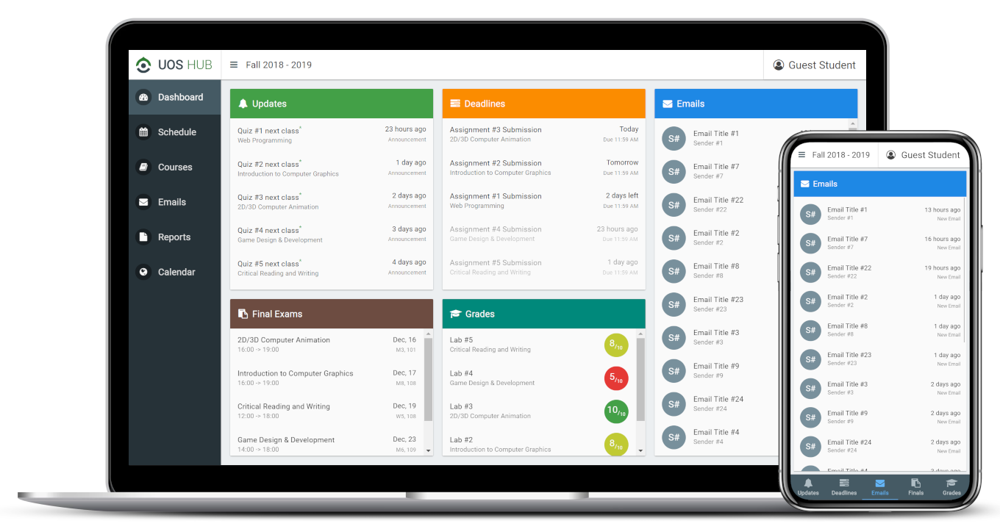

# UOS HUB Website Front-End

This repository contains the client-side code of UOS HUB website. 
We're using a JavaScript web framework called AngularJS to manage and render the data sent from the our server-side.
As for the visuals of the website, We're implementing the concepts of Google's [Material Design](https://material.io/guidelines). 
That's by using AngularJS Material, which can be programmed using HTML, CSS, and JavaScript.
On top of that, we're suing a flat icon pack called Font Awesome.

***

### Screenshot of the dashboard

For more, check out the current state of the website at the following link:
https://uoshub.github.io

***

### Details of the Front-End

##### What do files do?
The `layout.html` contains the common components of all the website's pages (like a template).  
The rest of the `*.html` files contain html code and components of their specific pages.  
The `js/scripts.js` contains all non-AngularJS JavaScript functions and variables.  
The `js/app.js` contains the main AngularJS app and its configurations and the common controllers.  
The rest of the `js/*.js` files contain AngularJS controller(s) for their specific pages.  
The `css/*.css` files contain styling rules for their specific pages.  
The `img/` folder contains all the image files of the website.

##### How are files loaded?
When requesting any link of our website, the server-side always responses with the `layout.html` first.
Then it loads the AngularJS app and logic, which requests the html page desired according to the requested link.
After the page and it's AngularJS controllers are loaded, it requests the page's data from the server as a JSON object.

Here's a summary of the general requests sequence:  
(1) `layout.html` --> (2) `page.html` --> (3) `data.json`

***

### Things to do in the future

There're a lot of thing we still need to do in the front-end:

- [x] Link the front-end with the back-end to reflect the retrieved data
- [x] Process the received data and implement the required filters and factories
- [ ] Add a sub-section for designing next semester's schedule live with drag and drop
- [ ] Add a section to display student's information and frequently looked up data
- [ ] Make the whole website responsive to all screen sizes
- [ ] Dynamically show or hide dashboard cards according to time of the semester
- [ ] Redesign account fees summary and e-services to make it less confusing
- [ ] Show classroom location on a map of the university (for freshmen)
- [ ] Allow students to review all courses together to avoid reading the forms again
- [ ] Add the ability to attach photos or notes to today’s classes
- [ ] Add a feature of sharing schedule with other students to get mutual free time slots
- [ ] Implement PWA concepts for native notifications and offline access

***

### References

- [AngularJS](https://github.com/angular/angular.js)
- [AngularJS Local Storage](https://github.com/gsklee/ngStorage)
- [AngularJS Material](https://github.com/angular/material)
- [AngularJS Material Calendar](https://github.com/jsmodules/angular-material-calendar)
- [Font Awesome](https://github.com/FortAwesome/Font-Awesome)
